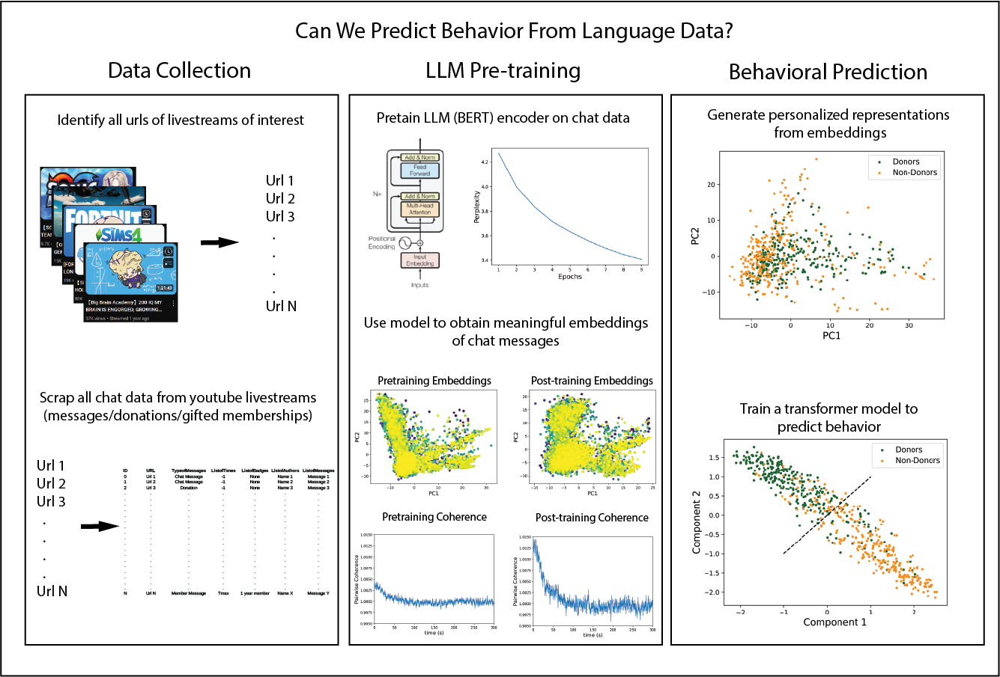

# Predicting Livestream Viewer Behavior from Chat Messages

## Table of Contents
- [Introduction](#introduction)
- [Project Structure](#project-structure)
- [Data Collection](#Data-Collection)
- [LLM Pre-training](#LLM-Pre--training)
- [Behavioral Prediction](#Behavioral-Prediction)
- [Results](#Results)
- [Data](#data)
- [Contact](#contact)

## Introduction

This project demonstrates how to implement behavioral prediction from language data through the use of a transformer neural network on embeddings generated from a BERT-based large language model (LLM). These models are implemented using a combination of PyTorch for the prediction network and Huggingface's open-source models for our LLM. All experiments are conducted within Google Colab notebooks.

This project is broken into 3 parts:

**1. Data Collection**

Livestream data for a particular streamer is scraped from YouTube in two steps. First, URLs of all livestreams are obtained from the channel, and then these URLs are used to scrape chat data. This livestream chat data is stored in an SQLite3 database for future reference.

**2. LLM Pre-training**

A fraction of the data is used to pre-train a BERT-based LLM. A sampled set of streams is used for pre-training, where messages are concatenated together before training. Training effectiveness is tested by assessing perplexity during training and by analyzing the decay of cosine distance between messages over time.

**3. Behavioral Prediction**

The trained LLM is utilized to generate representations of each individual viewer during a livestream. This is achieved by converting each message into an embedding using the encoder LLM and then incorporating time information into these embeddings. These encodings are then used to create a comprehensive representation of each viewer's messages sent during a livestream. An encoder transformer with a learnable CLS token is subsequently trained to classify donors from non-donors using a training-test data split.

**Below is a graphical outline illustrating each step of the process.**

## Project Structure
- /docs
  - README.md
  - /images
    - logo.png
- /src
  - main.py
  - /utils
    - helper.py
- LICENSE

## Data Collection

Livestream URLs and associated metadata (titles, dates) are collected from YouTube channels using the following approach:

- **Channel Information Retrieval:** Channel URLs and corresponding spreadsheet names are read from an ODS file.
- **Scraping Livestream URLs:** Selenium WebDriver is used to scroll through each channel's page, loading and extracting all livestream URLs. In this particular case, because we are using google colab, we use google_colab_selenium (Jacob Padilla, https://github.com/jpjacobpadilla/Google-Colab-Selenium/tree/main) to run Selenium in colab
- **Fetching Metadata with YouTube API:** Each livestream URL is queried using the YouTube Data API to retrieve metadata such as video title and upload date.
- **Organizing and Saving Data:** Retrieved metadata (titles, URLs, dates) are sorted chronologically and saved in an ODS file for further analysis.

After extracting urls and metadata, livestream chat data associated with each URL is extracted and stored for analysis:
- **Fetching Chat Messages:** Using the extracted livestream URLs, each chat messages are retrieved along with other metadata (including the sender name, the time, their membership status, the type of message, and the quantity and currency of money sent if the message is part of a donation). This is done using the chat_downloader library (Joshua Lochner, https://github.com/xenova/chat-downloader)
- **Storing in Database:** Chat messages, along with metadata (message type, author details, timestamps, donation details), are stored in an SQLite database (Db_file.dbs).

Both url/metadata extraction and chat data extraction code can be found in Cleaned_Urlscraper_and_databasegenerator.ipynb

If the database has already been created, and must instead be updated with new stream chat data, see Cleaned_DB_updater.ipynb

## LLM Pre-training

Using the data collected above, we train and evaluate a language model using Hugging Face's Transformers library. The workflow involves data extraction, preprocessing, tokenization, training, and evaluation.

- **Data Extraction:** The script reads a list of stream URLs and names from an Excel file and selects a subset of these streams.It then connects to a SQLite database and extracts messages, timestamps, and author names for each stream. Streams without any messages are filtered out.
  
- **Data Sorting:** Messages, timestamps, and author names are sorted by the timestamp to maintain chronological order.

- **Data Preprocessing and Tokenization:** Messages are tokenized using a pre-trained tokenizer from Hugging Face. The tokenized data is then grouped into chunks of a specified size to prepare it for training.

- **Dataset Preparation:** The script creates and concatenates tokenized datasets. A small subset of the data is removed in order to create a second evalution dataset for non-concatenated data. The remaining data is then split into training and test sets. Additionally, it prepares evaluation datasets by inserting random masks into the data, which helps in calculating the perplexity during evaluation.

- **Model Training and Evaluation:** Data loaders, optimizer, and learning rate scheduler are set up. The model is trained using an accelerator for efficient computation.The model's performance is evaluated by calculating the perplexity on both concatenated and original datasets. The script saves the model at specified checkpoints during training.

## Behavioral Prediction

## Results
### LLM Pre-training

The sucess of masked training for our BERT model can be tested by evaluating the loss by looking at the perplexity

To further test to see if pre-training finds 

### Behavioral Prediction

